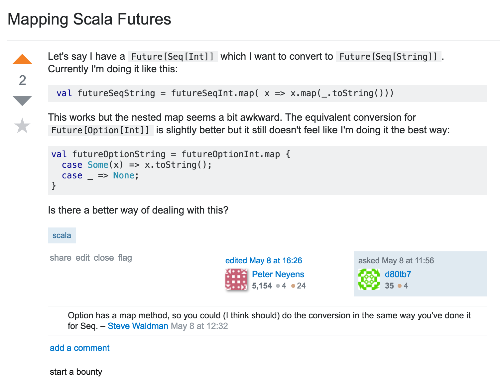

### Gabriele Petronella

# __Monad Transformers__
## just, why?


---

# me, hi!


---

# stuff I do

 


---


---

# a question

---



---

## the problem

```scala
val x: Future[List[Int]] = ???

futureList.map(list => list.map(f))
            ^                ^
            |________________|

```


**2 maps**  1 function

---

## can we do better?

---

## indent!

```scala
futureList.map { list =>
  list.map(f)
}
```

---


---

```scala
      future.map(f)                      list.map(f)
            |                                  |
            |                                  |
Functor[Future].map(future)(f)     Functor[List].map(list)(f)
```

---

```scala
                    futureList.map(f) // not really
                           |
                           |
        Functor[Future[List]].map(futureList)(f)
```

---

## in practice

```scala
import scala.concurrent.Future
import scala.concurrent.ExecutionContext.Implicits.global
import cats._; import std.future._; import std.list._

// create a `Functor[Future[List]`
val futureListF = Functor[Future].compose(Functor[List])

val data: Future[List[Int]] = Future(List(1, 2, 3))

// only one map!
futureListF.map(data)(_ + 1) // Future(List(2, 3, 4))
```

---

# cats


[https://github.com/typelevel/cats](https://github.com/typelevel/cats)

---

# about flattening

```scala
List(1, 2, 3).map(_ + 1) // List(2, 3, 4)

List(1, 2, 3).map(n => List.fill(n)(n))
// List(List(1), List(2, 2), List(3, 3, 3))

List(1, 2, 3).map(n => List.fill(n)(n)).flatten
// List(1, 2, 2, 3, 3, 3)
```

---

# flatMap

```scala
               flatten ∘ map = flatMap
```

so

```scala

List(1, 2, 3).map(n => List.fill(n)(n)).flatten

                          ==

List(1, 2, 3).flatMap(n => List.fill(n)(n))
```

---

# in other words

when life gives you `F[F[A]]`
you probably wanted `flatMap`

e.g.

```scala
val f: Future[Future[Int]] = Future(42).map(x => Future(24))

val g: Future[Int] = Future(42).flatMap(x => Future(24))
```

---

# a less contrived example

```scala
def getUser(name: String): Future[User]
def areFriends(a: User, b: User): Boolean
```

```scala
val f: Future[Boolean] =
  getUser("Gabriele").flatMap(
    gab => getUser("Giovanni").map(
      gio => areFriends(gab, gio)
    )
  )
```

---

# let's comprehend this

```scala
val f: Future[Boolean] =
  for {
    gab <- getUser("Gabriele")
    gio <- getUser("Giovanni")
  } yield areFriends(gab, gio)
```

---

# lessons

monads allow sequential execution

monads can squash `F[F[A]]` into `F[A]`

---

# questions?

---

# wait a second...

---

# what about `F[G[X]]`

---

# Back to the real world


```scala
def getUser(name: String): Future[User] // <- really?
def areFriends(a: User, b: User): Boolean
```

---

# Back to the real world

```scala
def getUser(name: String): Future[Option[User]] // better
def areFriends(a: User, b: User): Boolean
```

---

# Uh, oh...

```scala
val f: Future[Boolean] =
  for {
    gab <- getUser("Gabriele")
    gio <- getUser("Giovanni")
  } yield areFriends(gab, gio) // 😰 FAIL
```

---

# eventually

```scala
val f: Future[Option[Boolean]] =
  for {
    gab <- getUser("Gabriele")
    gio <- getUser("Giovanni")
  } yield areFriends(gab.get, gio.get) // 😱
```

---


---

# do you even __yield__, bro?

```scala
val f: Future[Option[Boolean]] =
  for {
    maybeGab <- getUser("Gabriele")
    maybeGio <- getUser("Giovanni")
  } yield for {
    gab <- maybeGab
    gio <- maybeGio
  } yield areFriends(gab, gio) // 😳
```

---

# do you even __match__, bro?


```scala
val f: Future[Option[Boolean]] =
  for {
    maybeGab <- getUser("Gabriele")
    maybeGio <- getUser("Giovanni")
  } yield (maybeGab, maybeGio) match {
    case (Some(gab), Some(gio)) => Some(areFriends(gab, gio))
    case _ => None
  } // 😲
```

---
```scala
        futureUser.flatMap(f)                 maybeUser.flatMap(f)
                |                                      |
                |                                      |
  Monad[Future].flatMap(futureUser)(f)   Monad[Option].flatMap(maybeUser)f)
```
---

```scala

            futureMaybeUser.flatMap(f)
                         |
                         |
            Monad[Future[Option]].flatMap(f)
```

---

```scala

            futureMaybeUser.flatMap(f)
                         |
                         |
            Monad[Future[Option]].flatMap(f)
```


---

# monads do not __compose__


### [http://blog.tmorris.net/posts/monads-do-not-compose/](http://blog.tmorris.net/posts/monads-do-not-compose/)

---


---

## what's the __impossible__ part?

```scala
// trivial
def compose[F[_]: Functor, G[_]: Functor]: Functor[F[G[_]]] = ✅

// impossible
def compose[M[_]: Monad, N[_]: Monad]: Monad[M[N[_]]] = 📛


// (not valid scala, but you get the idea)
```
---

## monads do not compose
# __GENERICALLY__

---

# but you can compose them __specifically__

---

```scala
case class FutOpt[A](value: Future[Option[A])
```

---

```scala
new Monad[FutOpt] {

  def pure[A](a: => A): FutOpt[A] = FutOpt(a.pure[Option].pure[Future])

  def map[A, B](fa: FutOpt[A])(f: A => B): FutOpt[B] =
    FutOpt(fa.value.map(optA => optA.map(f)))

  def flatMap[A, B](fa: FutOpt[A])(f: A => FutOpt[B]): FutOpt[B] =
    FutOpt(fa.value.flatMap(opt => opt match {
      case Some(a) => f(a).value
      case None => (None: Option[B]).pure[Future]
    }))

}
```
 
---

# and use

```scala
val f: FutOpt[Boolean] =
  for {
    gab <- FutOpt(getUser("Gabriele"))
    gio <- FutOpt(getUser("Giovanni"))
  } yield areFriends(gab, gio) // 🎉

val g: Future[Option[Boolean]] = f.value

```

---

# what if

```scala
def getUsers(query: String): List[Option[User]]
```

---

```scala
case class ListOpt[A](value: List[Option[A])
```

---

```scala
new Monad[ListOpt] {

  def pure[A](a: => A): ListOpt[A] = ListOpt(a.pure[Option].pure[List])

  def map[A, B](fa: ListOpt[A])(f: A => B): ListOpt[B] =
    ListOpt(fa.value.map(optA => optA.map(f)))

  def flatMap[A, B](fa: ListOpt[A])(f: A => ListOpt[B]): ListOpt[B] =
    ListOpt(fa.value.flatMap(opt => opt match {
      case Some(a) => f(a).value
      case None => (None: Option[B]).pure[List]
    }))

}
```

---

```scala
new Monad[FutOpt] {

  def pure[A](a: => A): FutOpt[A] = FutOpt(a.pure[Option].pure[Future])

  def map[A, B](fa: FutOpt[A])(f: A => B): FutOpt[B] =
    FutOpt(fa.value.map(optA => optA.map(f)))

  def flatMap[A, B](fa: FutOpt[A])(f: A => FutOpt[B]): FutOpt[B] =
    FutOpt(fa.value.flatMap(opt => opt match {
      case Some(a) => f(a).value
      case None => (None: Option[B]).pure[Future]
    }))

}
```

---

# meet `OptionT`

`OptionT[[F[_], A]`

```scala

val f: OptionT[Future, Boolean] =
  for {
    gab <- OptionT(getUser("Gabriele"))
    gio <- OptionT(getUser("Giovanni"))
  } yield areFriends(gab, gio) // 🎉

val g: Future[Option[Boolean]] = f.value
```

---


# another example

```scala
def getUser(id: String): Future[Option[Int]] = ???
def getAge(user: User): Future[Int] = ???
def getNickname(user: User): Option[String] = ???
```
```scala
val lameNickname: Future[Option[String]] = ???
// e.g. Success(Some("gabro27"))
```
---

# I know the trick!
```scala
val lameNickname: Future[Option[String]] =
  for {
    user <- OptionT(getUser("123"))
    age  <- OptionT(getAge(user))  // sorry, nope
    name <- OptionT(getName(user)) // sorry, neither
  } yield s"$name$age"
```

---


---

# do you even __lift__, bro?

```scala
val lameNickname: Future[Option[String]] =
  for {
    user <- OptionT(getUser("123"))
    age  <- OptionT.liftF(getAge(user))
    name <- OptionT.fromOption(getName(user))
  } yield s"$name$age"
```

---

## example: updating a user

- check user exists
- check it can be updated
- update it

---

## the naive way

```scala
def checkUserExists(id: String): Future[Option[User]]
def checkCanBeUpdated(u: User): Future[Boolean]
def updateUserOnDb(u: User): Future[User]
```

---

## problems

```scala
def updateUser(u: User): Future[Option[User]] =
  checkUserExists.flatMap { maybeUser =>
    maybeUser.map { user =>
      checkCanBeUpdated(user).flatMap { canBeUpdated =>
        if (canBeUpdated) {
          updateUserOnDb(u)
        } else {
          Future(None)
        }
      }
    }
  }
```

---

## more __problems__ (specific errors)

```scala
case class MyError(msg: String)
def updateUser(user: User): Future[Xor[MyError, User]] =
  checkUserExists(user.id).flatMap { maybeUser =>
    maybeUser.map { user =>
      checkCanBeUpdated(user).flatMap { canBeUpdated =>
        if (canBeUpdated) {
          updateUserOnDb(u)
        } else {
          Future(MyError("user cannot be updated"))
        }
      }
    }.getOrElse(MyError("user not existing"))
  }
```

---

# more transformers

`XorT[F[_], A, B]`

## how about

```scala
case class MyError(msg: String)
type Result[A] = Xor[MyError, A]
type ResultT[F, A] = XorT[F, MyError, A]]
type FutureResult[A] = ResultT[Future, A]
```

---

# better?


```scala
def checkUserExists(id: String): FutureResult[User] = Future {
  if (id === "123")
    User("123").right
  else
    MyError("sorry, no user").left
}

def checkCanBeUpdated(u: User): FutureResult[User] = ???

def updateUserOnDb(u: User): FutureResult[User] = ???
```

---

# better?

```scala
def updateUser(user: User): FutureResult[User] = for {
  u <- checkUserExists(user.id)
  _ <- checkCanBeUpdated(u)
  updatedUser <- updateUser(user)
} yield updatedUser
```

---

# personal __tips__

---

# tip __#1__

stacking more than __two__ monads
gets bad really quickly

---

# example (from _djspiewak/emm_)

```scala
val effect: OptionT[EitherT[Task, String, ?], String] = for {
  first <- readName.liftM[EitherT[?[_], String, ?]].liftM[OptionT]
  last <- readName.liftM[(EitherT[?[_], String, ?]].liftM[OptionT]

  name <- if ((first.length * last.length) < 20)
    OptionT.some[EitherT[Task, String, ?], String](s"$first $last")
  else
    OptionT.none[EitherT[Task, String, ?], String]

  _ <- (if (name == "Daniel Spiewak")
    EitherT.fromDisjunction[Task](\/.left[String, Unit]("your kind isn't welcome here"))
  else
    EitherT.fromDisjunction[Task](\/.right[String, Unit](()))).liftM[OptionT]

  _ <- log(s"successfully read in $name").liftM[EitherT[?[_], String, ?]].liftM[OptionT]
} yield name
```

---

# tip __#2__

keep your transformers for youself

```scala
def publicApiMethod(x: String): OptionT[Future, Int] = 😰
def publicApiMethod(x: String): Future[Option[Int]] = 😊
```

by the way

```scala
val x: OptionT[Future, Int] = OptionT(Future(Option(42)))
val y: Future[Option[Int]] = x.value // Future(Option(42))
```

---

# Monad Transformers: __takeaways__

- they end with `T`
- `F[G[X]]` becomes `GT[F[_], X]`
- can be stacked undefinitely, but gets awkward
- they are __a__ tool for stacking effects

---

# what else?

---

# free monads

- clearly separate structure and interpretation
- effects are separated from program definition

[https://github.com/typelevel/cats/blob/master/docs/src/main/tut/freemonad.md](https://github.com/typelevel/cats/blob/master/docs/src/main/tut/freemonad.md)

---

# eff

__[https://github.com/atnos-org/eff-cats](https://github.com/atnos-org/eff-cats)__

"Extensible effects are an alternative to monad transformers for computing with effects in a functional way"


based on [Freer Monads, More Extensible Effects](http://okmij.org/ftp/Haskell/extensible/more.pdf)
by Oleg Kiselyov

---

# emm

__[https://github.com/djspiewak/emm](https://github.com/djspiewak/emm)__

Otherwise known as "less confusing monad transformers"

---

# [fit] [http://slack.scala-italy.it/](http://slack.scala-italy.it/)
 

---

# [fit] work@buildo.io


---


---

# [fit] __`questionsT`__

@gabro27
@buildo
@milanoscala
@scalaitaly